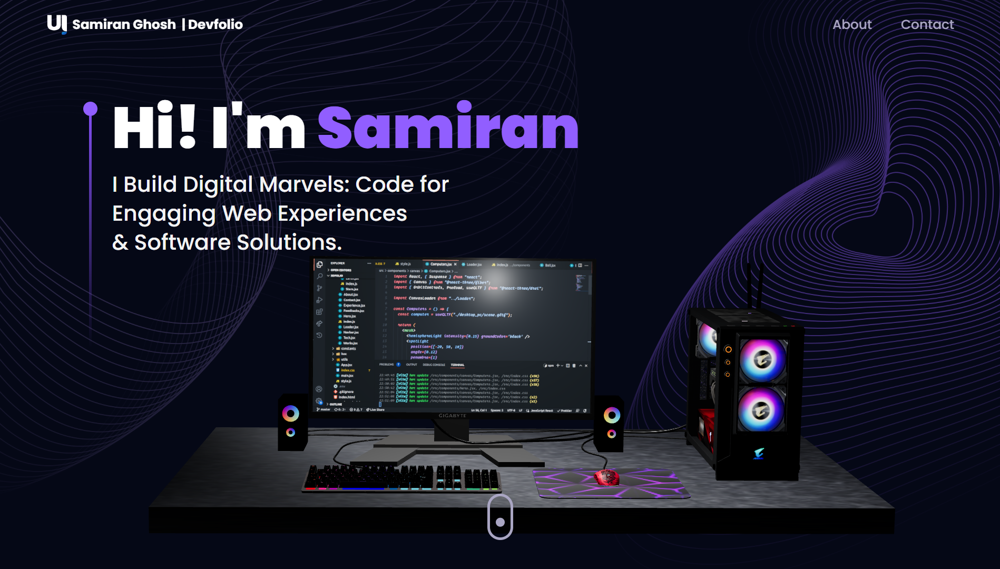

# My Devfolio

This is my personal portfolio website built using Vite, React, Tailwind CSS, react-three-fiber, react-three/drei, Framer Motion, emailjs, and react-tilt. The portfolio showcases my skills, projects, and experiences in the world of web development and computer graphics.

## Table of Contents

- [About Me](#about-me)
- [Demo](#demo)
- [Features](#features)
- [Technologies Used](#technologies-used)
- [Installation](#installation)
- [Usage](#usage)
- [Contact](#contact)

## About Me

I am a passionate and skilled MCA student with a strong foundation in software development principles and a keen interest in UI/UX design. Alongside my technical expertise, I possess exceptional proficiency in digital photorealistic art. My journey in the world of web development has led me to explore various technologies, including JavaScript, Python, Node.js, Express, Axios, React, Docker, MongoDB, and SQL. I have hands-on experience with frontend technologies such as Tailwind CSS, Shadcn, MUI, Bootstrap, HTML, and CSS.

As a quick learner and a creative problem solver, I am eager to collaborate on projects that challenge me to push the boundaries of innovation. Through my portfolio, I aim to showcase my accomplishments, projects, and experiences to make a positive impact in the tech community.

## Demo
Visit the live portfolio website [here](livedemo).

## Features
- Interactive 3D models powered by react-three-fiber and react-three/drei.
- Smooth animations and transitions using Framer Motion.
- Contact form integration with emailjs for seamless communication.
- Tilt effect for a playful user experience using react-tilt.
- Responsive design for optimal viewing across devices.

## Technologies Used

- Vite
- React
- Tailwind CSS
- react-three-fiber
- react-three/drei
- Framer Motion
- emailjs
- react-tilt

## Installation

1. Clone the repository.
2. Run `npm install` to install the dependencies.

## Usage

1. Run `npm run dev` to start the development server.
2. Open your browser and visit `http://localhost:5173` to view the portfolio.

## Contact

Feel free to reach out to me at [samiranghoshofficial04@gmail.com](mailto:samiranghoshofficial04@gmail.com) for any inquiries or collaboration opportunities.
